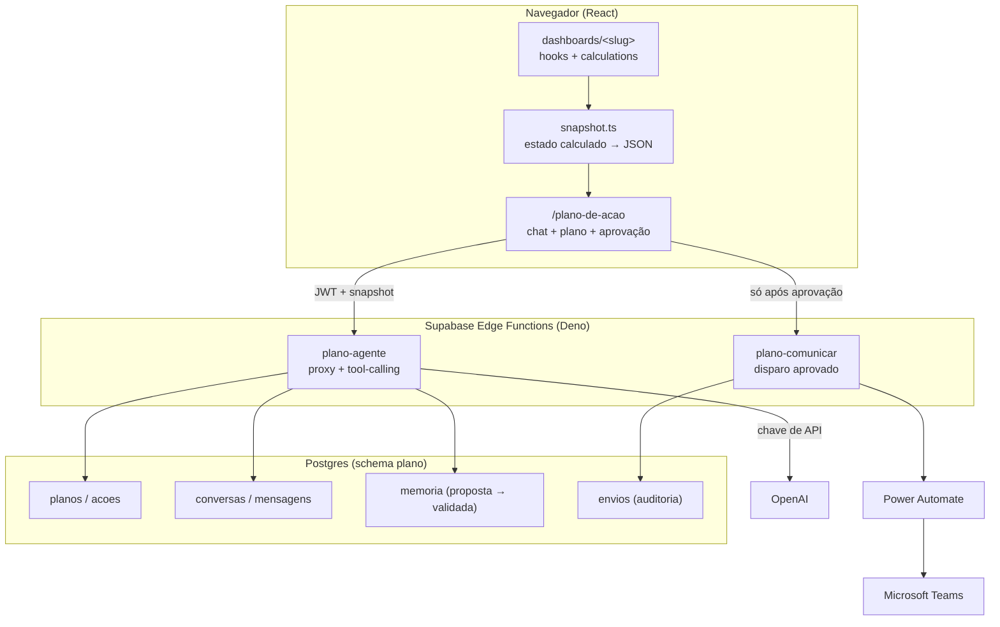

# Plano de Ação com LLM — Arquitetura proposta

Documento de decisão para o módulo **Plano de Ação** da FMP Analytics.
Escrito no formato de contrato do `SPECS.md`: **DEVE / NUNCA** são regras duras,
**DECISÃO** resolve um ponto em aberto, **PADRÃO** é convenção herdada.

Premissas confirmadas (atualizadas em 06/08/2026): LLM **OpenAI direto**
(chave de API, sem Azure OpenAI), comunicação por **Power Automate → Microsoft
Teams** — o Azure entra só como casa do Teams —, autonomia **sugere e humano
aprova**, primeira entrega **MVP sobre um dashboard** (`growth-e-performance`).

---

## 1. A decisão que define tudo o resto

> **A LLM lê o estado *calculado* da tela, nunca o banco e nunca a imagem.**

Existem três formas de "a LLM entender o dashboard". Duas são armadilhas:

| Abordagem | Por que falha aqui |
|---|---|
| **Visão / screenshot da tela** | Caro, lento, não determinístico. A LLM lê "R$ 872 mil" de um rótulo abreviado e perde o valor exato. Não sabe qual filtro está ativo. Quebra a cada mudança de layout. |
| **Tool de SQL sobre o Supabase** | Fura a paridade com o Power BI (§12 do SPECS): a regra de negócio vive em `calculations.ts`, não no banco. A LLM recalcularia "matrículas" com um `COUNT(*)` e devolveria um número **diferente do que está na tela** — o pior defeito possível segundo o §13/§15.1. Além disso exige credencial ampla no servidor, contornando a RLS. |
| **Snapshot do estado calculado** ✅ | A aplicação já agrega tudo no navegador. O painel entrega à LLM exatamente os números que o gestor está vendo, com os filtros ativos e o carimbo de frescor. Zero consulta nova, zero PII, paridade garantida por construção. |

**DECISÃO**: o contrato entre dashboard e agente é um **snapshot JSON**, montado
no cliente a partir do dado que o painel já tem em memória.

Consequências boas de graça:

- O aquecimento (§7.3) já baixa os cinco painéis por sessão — montar o snapshot
  dos outros painéis custa **zero requisição**.
- A LLM enxerga a mesma verdade que o gestor. Se o número da tela está errado, o
  plano está errado *do mesmo jeito* — o que é auditável e corrigível.
- Privacidade (§13) sobrevive intacta: o snapshot é agregado, nunca linha crua.

---

## 2. Visão geral



Quatro camadas, cada uma com uma responsabilidade única:

1. **Leitura** — `snapshot.ts` por dashboard (front).
2. **Raciocínio** — Edge Function `plano-agente` (chave da LLM fica no servidor).
3. **Persistência** — schema `plano` no Postgres, com RLS.
4. **Comunicação** — Edge Function `plano-comunicar` → Power Automate → Teams.

---

## 3. Camada 1 — Contrato de snapshot

### 3.1 Onde mora

Um arquivo novo na anatomia obrigatória do §5:

```
src/dashboards/<slug>/
  snapshot.ts        NOVO — estado calculado → DashboardSnapshot
src/lib/
  snapshotRegistry.ts  NOVO — mapa slug → builder, usado pelo módulo de plano
  snapshotTypes.ts     NOVO — o tipo compartilhado
```

`snapshot.ts` **DEVE** ser puro, como `calculations.ts`: entra o que o hook já
calculou, sai o JSON. **NUNCA** faz fetch.

### 3.2 O tipo

```ts
export type Indicador = {
  chave: string;              // 'cac', 'roas', 'matriculas'
  rotulo: string;             // 'CAC'
  valor: number | null;       // null = sem dado (nunca 0 no lugar de vazio, §11)
  unidade: 'brl' | 'pct' | 'int' | 'ratio';
  meta?: number | null;
  variacaoPeriodoAnterior?: number | null;
  amostraPequena?: boolean;   // herda OrigemDatum.amostraPequena
  glossario?: string;         // "custo por lead pago = investimento / leads"
};

export type Serie = {
  chave: string;
  rotulo: string;
  eixo: 'tempo' | 'categoria';
  pontos: Array<{ r: string; v: number | null }>;  // r = rótulo, v = valor
  truncadaEm?: number;        // top-N: a LLM precisa saber que foi cortada
};

export type DashboardSnapshot = {
  versao: 1;
  slug: string;
  titulo: string;
  geradoEm: string;                 // ISO
  recorte: {                        // os filtros ativos, em português legível
    descricao: string;              // "Pós-Graduação · Meta · 01/01–31/07/2026"
    filtros: Record<string, string | string[] | null>;
  };
  frescor: Array<{ fonte: string; sinal: string; alerta: boolean }>;
  indicadores: Indicador[];
  series: Serie[];
  observacoes: string[];            // regras herdadas do BI que afetam a leitura
};
```

### 3.3 Regras

- **DEVE** caber em **~15 KB por painel**. Série longa vai truncada por top-N
  com `truncadaEm` preenchido — LLM que não sabe que o dado foi cortado inventa
  tendência.
- **NUNCA** incluir nome, CPF, RA, e-mail, telefone ou qualquer linha individual
  de aluno. O snapshot é agregado por construção (§13 continua valendo).
- **DEVE** carregar `frescor` junto. Plano feito sobre carga parada é plano
  errado, e o agente precisa poder dizer isso.
- **DEVE** carregar `glossario` nos indicadores não óbvios. É o mesmo texto do
  `hint` do `StatCard` — reaproveite, não escreva um segundo.
- **DEVE** carregar `observacoes` com as regras herdadas do Power BI que mudam a
  leitura ("faturamento do Pós considera ajuste manual em 28/05"). Sem isso a
  LLM vai "descobrir" uma anomalia que na verdade é regra documentada.

### 3.4 Exemplo — `growth-e-performance`

O painel já produz `MediaMetrics`, `NegocioMetrics`, `OrigemData`,
`CampanhaRow[]`, `HorarioDatum[]`, `MapaUfDatum[]`. O builder é quase só
tradução:

```ts
export function buildGrowthSnapshot(
  m: MediaMetrics, n: NegocioMetrics, origem: OrigemData,
  campanhas: CampanhaRow[], filtros: GrowthFilters,
  ritmos: Record<string, RitmoFonte>,
): DashboardSnapshot {
  return {
    versao: 1,
    slug: 'growth-e-performance',
    titulo: 'Growth e Performance',
    geradoEm: new Date().toISOString(),
    recorte: { descricao: descreveRecorte(filtros), filtros: { ...filtros } },
    frescor: resumeFrescor(ritmos),
    indicadores: [
      { chave: 'cpl', rotulo: 'CPL', valor: m.cpl, unidade: 'brl',
        glossario: 'Investimento em mídia dividido por leads do Rubeus no recorte.' },
      { chave: 'cac', rotulo: 'CAC', valor: n.cac, unidade: 'brl' },
      { chave: 'roas', rotulo: 'ROAS', valor: n.roas, unidade: 'ratio' },
      { chave: 'matriculas', rotulo: 'Matrículas', valor: n.matriculas, unidade: 'int' },
      { chave: 'taxa_conv', rotulo: 'Conversão', valor: n.taxaConv, unidade: 'pct' },
      // …
    ],
    series: [
      { chave: 'campanhas', rotulo: 'Campanhas por leads', eixo: 'categoria',
        pontos: topN(campanhas, 12).map(c => ({ r: c.campanha, v: c.leads })),
        truncadaEm: 12 },
      { chave: 'origem_canal', rotulo: 'Conversão por canal', eixo: 'categoria',
        pontos: origem.porCanal.map(o => ({ r: o.nome, v: o.taxa })) },
    ],
    observacoes: [
      'Taxa de canal com menos de 50 pessoas é marcada como amostra pequena e não sustenta decisão.',
    ],
  };
}
```

---

## 4. Camada 2 — Edge Function `plano-agente`

### 4.1 Por que Edge Function e não chamada direta do navegador

Não é preferência de estilo. A chave da Azure OpenAI **NUNCA** pode ir para o
bundle: `VITE_*` é embutida em build-time e é pública (§13, §14). Chave no
front = qualquer visitante do site consumindo a cota da FMP. A Edge Function é o
único lugar onde ela pode viver, como *secret* do Supabase.

Além disso a função concentra o que não pode ser confiado ao cliente: limite de
uso, guarda de papel, validação do plano e auditoria.

### 4.2 Contrato

| Rota | JWT | Papel | Função |
|---|---|---|---|
| `POST /functions/v1/plano-agente` | sim | gestor/admin | turno de conversa com tool-calling |
| `POST /functions/v1/plano-comunicar` | sim | **admin** (ou papel novo `aprovador`) | dispara o webhook de um plano aprovado |

Como no `usuarios-admin`, `verify_jwt` garante token válido mas **não** garante
papel: a função **DEVE** reconferir `perfis.papel` no banco (§6.3).

Requisição:

```jsonc
{
  "conversa_id": "uuid | null",
  "mensagem": "por que o CAC do Pós subiu em julho?",
  "contexto": {
    "slug_ativo": "growth-e-performance",
    "snapshots": { "growth-e-performance": { /* DashboardSnapshot */ } }
  }
}
```

O cliente manda os snapshots que já tem em memória. O servidor **NUNCA** consulta
tabela de negócio — ele só resolve `ler_dashboard(slug)` a partir desse mapa.

### 4.3 Ferramentas expostas ao modelo

Poucas e fechadas. Toolset grande é fonte de alucinação e de custo.

| Ferramenta | Efeito |
|---|---|
| `listar_dashboards()` | slugs + títulos + descrição do recorte disponível |
| `ler_dashboard(slug)` | devolve o snapshot **do payload**, não do banco |
| `listar_pessoas()` | `perfis`: nome, cargo, área, papel — são **colaboradores**, não alunos; §13 não se aplica |

> `public.perfis` hoje tem `nome_completo`, `cargo` e `papel`, mas **não tem
> `area`** (ver `authService.ts`). Atribuir ação por área exige uma coluna
> `area text` em `perfis`, com migração e campo na tela `/usuarios`. É o menor
> pré-requisito do módulo e vale fazer já na Fase 1.
| `buscar_memoria(consulta)` | cauda de texto livre; o grosso já vem pré-carregado por filtro (§5.3.1) |
| `propor_memoria(tipo, conteudo, escopo, validade)` | devolve a proposta **para a tela**; **NUNCA** grava direto |
| `propor_plano(plano)` | *structured output* com o JSON do plano; **não persiste**, devolve para a tela |

**NUNCA** expor ao modelo: SQL livre, `fetch` arbitrário, envio de comunicação,
escrita em tabela de negócio, gravação direta de memória validada.

### 4.4 Guarda de números — a regra que salva o projeto

**DEVE** existir, no servidor, uma validação pós-resposta: **todo número citado
no plano precisa existir no snapshot**.

```ts
// Cada ação carrega evidencia: { dashboard, indicador, valor }.
// Se snapshot[dashboard].indicadores[indicador].valor !== valor → rejeita o turno
// e devolve ao modelo "corrija: valor divergente da fonte".
```

Sem essa guarda, o módulo produz plano bonito com número inventado — exatamente
o antipadrão nº 1 do SPECS ("fallback silencioso de dado de negócio"). Com ela,
cada ação na tela vira um link clicável de volta para o KPI que a originou.

### 4.5 Custo e limite

- **DEVE** cachear por `hash(snapshot + pergunta)`. Mesmo recorte, mesma
  pergunta, mesmo dia ⇒ resposta do cache. Gestor reabre a tela o dia inteiro.
- **DEVE** limitar por usuário/dia (sugestão: 40 turnos) e cortar histórico de
  conversa em ~20 mensagens, resumindo o excedente para `plano.memoria`.
- Modelo grande só no *raciocínio do plano*; chat de acompanhamento pode ir em
  modelo menor. A diferença de conta no fim do mês é grande.

---

## 5. Camada 3 — Persistência

### 5.1 O desvio do SPECS que precisa ser registrado

O §2 diz que a aplicação é **somente leitura sobre dados de negócio** e o §6.2
proíbe `INSERT` a partir do front. Isso continua verdadeiro e **NUNCA** deve ser
relaxado para `stg_*`, Rubeus ou mídia.

**DECISÃO**: plano de ação é **dado próprio da aplicação**, não dado de negócio.
Vive em um **schema separado `plano`**, com escrita permitida. A separação por
schema — e não por prefixo de tabela — deixa a auditoria trivial: nenhuma tabela
de negócio ganha policy de escrita, em nenhuma hipótese.

Isso exige uma seção nova no `SPECS.md` (o próprio §16 cobra isso).

### 5.2 Tabelas

```sql
create schema if not exists plano;

-- Conversa com o agente
create table plano.conversas (
  id uuid primary key default gen_random_uuid(),
  autor_id uuid not null references public.perfis(id) on delete cascade,
  dashboard_slug text,
  titulo text,
  criado_em timestamptz not null default now()
);

create table plano.mensagens (
  id bigserial primary key,
  conversa_id uuid not null references plano.conversas(id) on delete cascade,
  papel text not null check (papel in ('user','assistant','tool')),
  conteudo jsonb not null,
  tokens int,
  criado_em timestamptz not null default now()
);

-- O plano
create table plano.planos (
  id uuid primary key default gen_random_uuid(),
  titulo text not null,
  dashboard_slug text not null,
  recorte jsonb not null,              -- filtros ativos quando o plano nasceu
  snapshot jsonb not null,             -- congela a evidência (auditoria)
  status text not null default 'rascunho'
    check (status in ('rascunho','em_revisao','aprovado','arquivado')),
  autor_id uuid not null references public.perfis(id),
  aprovado_por uuid references public.perfis(id),
  aprovado_em timestamptz,
  criado_em timestamptz not null default now(),
  atualizado_em timestamptz not null default now()
);

create table plano.acoes (
  id uuid primary key default gen_random_uuid(),
  plano_id uuid not null references plano.planos(id) on delete cascade,
  ordem int not null default 0,
  area text not null,                  -- 'Marketing', 'Comercial', 'Acadêmico'…
  titulo text not null,
  descricao text,
  responsavel_id uuid references public.perfis(id),
  prazo date,
  esforco text check (esforco in ('baixo','medio','alto')),
  impacto text check (impacto in ('baixo','medio','alto')),
  prioridade int,                      -- 1..5, derivado de impacto × esforço
  status text not null default 'pendente'
    check (status in ('pendente','em_andamento','concluida','cancelada')),
  evidencia jsonb,                     -- { dashboard, indicador, valor }
  criado_em timestamptz not null default now()
);

-- Memória institucional — o coração do módulo (ver §5.3)
create table plano.memoria (
  id uuid primary key default gen_random_uuid(),
  tipo text not null check (tipo in
    ('sazonalidade','processo','hierarquia','correcao','licao_aprendida','restricao','glossario')),
  conteudo text not null,              -- a frase, como o usuário ensinou

  -- ESCOPO: as dimensões que decidem quando esta memória é carregada.
  -- NULL = "vale sempre". Preenchido = "vale só nesse recorte".
  dashboard_slug text,                 -- 'growth-e-performance'
  produto text,                        -- 'pos-ead', 'especializacao', 'mestrado'
  indicador text,                      -- 'cpl', 'cac' — a métrica que ela corrige
  area text,                           -- 'Marketing', 'Comercial'
  meses smallint[],                    -- {7} ou {1,8} — sazonalidade, recorrente
  campanha text,

  -- VALIDADE: memória sem prazo vira mentira repetida para sempre.
  vigente_de date,
  vigente_ate date,                    -- null = permanente

  status text not null default 'proposta'
    check (status in ('proposta','validada','recusada','substituida')),
  substitui uuid references plano.memoria(id),   -- resolução de contradição
  origem text not null default 'llm' check (origem in ('llm','humano')),
  ensinado_por uuid not null references public.perfis(id),
  validado_por uuid references public.perfis(id),
  validado_em timestamptz,
  usos int not null default 0,         -- quantos planos já usaram (§5.3)
  busca tsvector generated always as
    (to_tsvector('portuguese', unaccent(conteudo))) stored,
  criado_em timestamptz not null default now()
);
create index on plano.memoria using gin (busca);
create index on plano.memoria (status, dashboard_slug, produto, area);
create index on plano.memoria using gin (meses);

-- De onde veio cada memória: rastreabilidade até a conversa que a gerou.
create table plano.memoria_origem (
  memoria_id uuid primary key references plano.memoria(id) on delete cascade,
  acao_id uuid references plano.acoes(id) on delete set null,
  conversa_id uuid references plano.conversas(id) on delete set null,
  trecho text                          -- a fala do usuário, literal
);

-- Auditoria de comunicação
create table plano.envios (
  id bigserial primary key,
  plano_id uuid not null references plano.planos(id) on delete cascade,
  canal text not null,                 -- 'n8n', 'teams'
  destino text,
  payload jsonb not null,
  status_http int,
  resposta text,
  enviado_por uuid not null references public.perfis(id),
  enviado_em timestamptz not null default now()
);
```

### 5.3 Memória institucional

#### 5.3.1 Recuperação: chave antes de semântica

**DECISÃO**: a memória é recuperada por **filtro nas dimensões do snapshot**,
não por similaridade. Banco vetorial **NÃO** entra na primeira versão, e **NUNCA**
como serviço externo.

A razão é que quase tudo que a equipe vai ensinar **tem chave natural**:

| O que o gestor ensina | Chave real | Recuperação certa |
|---|---|---|
| "Julho é fraco no EAD por causa do recesso" | produto + mês | `produto='pos-ead' and 7 = any(meses)` |
| "Não avalie o CPL do topo isoladamente" | painel + indicador | `dashboard='growth' and indicador='cpl'` |
| "Pausar acima de R$ 10 mil exige aval" | painel | `dashboard='growth'` |
| "Juliana está de licença até 18/08" | área + data | `area='Comercial' and vigente_ate >= hoje` |
| "Estamos com equipe reduzida, o clima está tenso" | *nenhuma* | busca textual |

Quando existe chave, filtrar é **estritamente melhor** que embutir: é
determinístico, é barato, e — o que mais importa aqui — **é auditável**. Dá para
mostrar ao usuário exatamente quais memórias entraram no plano. Busca vetorial
pode simplesmente não devolver a nota de sazonalidade num dia ruim, e ninguém
percebe. Numa casa que escreveu o §15.1 do SPECS contra fallback silencioso,
isso é inaceitável.

A regra de carregamento:

```sql
-- Dimensões vêm do próprio snapshot que o painel montou.
select * from plano.memoria
where status = 'validada'
  and (vigente_ate is null or vigente_ate >= current_date)
  and (dashboard_slug is null or dashboard_slug = :slug)
  and (produto        is null or produto        = :produto)
  and (indicador      is null or indicador      = any(:indicadores))
  and (area           is null or area           = any(:areas))
  and (meses          is null or :mes           = any(meses));
```

#### 5.3.2 O melhor RAG é não fazer RAG

Com 8 usuários, a memória validada vai ter **dezenas a poucas centenas** de
linhas no primeiro ano. 200 memórias × ~45 tokens ≈ **9 mil tokens** — cabe
inteira no contexto.

**DECISÃO**: enquanto o conjunto filtrado couber em ~15k tokens, ele vai
**inteiro** para o prompt. Sem ranqueamento, sem recorte, sem chance de perder a
nota decisiva. Só quando estourar esse teto é que entra ordenação (por `usos`,
recência e especificidade do escopo).

Isso não é preguiça de engenharia: é a configuração com **maior taxa de acerto**
nessa escala. RAG existe para quando o corpus não cabe — introduzi-lo antes disso
só adiciona uma forma de errar.

#### 5.3.3 Quando o vetorial passa a valer

`vector 0.8.0` já está disponível no projeto (não instalado) — é um
`create extension` no mesmo Postgres, sem infra nova. Migre para busca híbrida
(filtro + FTS + embedding) quando **um destes** acontecer:

1. Passar de ~1.500 memórias validadas, ou o conjunto filtrado estourar 15k tokens.
2. Aparecerem memórias longas e sem chave (atas, relatos de reunião, decisões
   narrativas) — aí o texto livre domina e a similaridade ganha.
3. A tela "O que ela aprendeu" mostrar, com frequência, memória certa que o plano
   deixou de usar.

Até lá, `tsvector('portuguese')` + `unaccent` cobre a cauda de texto livre.
`unaccent` é obrigatório: sem ele "matrícula" e "matricula" são termos distintos.

**NUNCA** um banco vetorial externo (Pinecone, Qdrant, Weaviate). São: um segundo
datastore para operar, uma segunda autenticação, um segundo backup, uma segunda
superfície de vazamento — e um caminho para dado da FMP sair do Postgres onde a
RLS já resolve o problema.

#### 5.3.4 Escopo e validade — a regra que impede a mentira permanente

Toda memória **DEVE** nascer com **escopo** e, quando circunstancial, com
**validade**.

- Memória sem escopo vira ruído: "não pausar campanha" aplicado ao Mestrado
  quando valia só para o EAD.
- Memória sem validade vira mentira: "Juliana está de licença" repetido em
  novembro.
- **DEVE** existir tipo `sazonalidade` com `meses[]` **recorrente** — é o único
  tipo que volta todo ano e por isso não tem `vigente_ate`.
- O agente **DEVE** propor escopo e validade, e o usuário **DEVE** poder corrigir
  antes de guardar. **NUNCA** guardar escopo inferido em silêncio.

#### 5.3.5 Quem valida o quê

Validação centralizada em admin mata o hábito de ensinar — se cada correção
espera aprovação, ninguém corrige. Mas memória institucional sem controle vira
boato com carimbo de sistema.

**DECISÃO**, por alcance:

| Alcance da memória | Quem valida |
|---|---|
| Escopo com `area`/`produto`/`dashboard` preenchido | o próprio autor, no momento (um clique) |
| Escopo aberto (`toda a instituição`) ou tipo `hierarquia` | **admin**, na tela de memória |
| Contradiz memória validada existente | **admin**, escolhendo qual vale |

- **NUNCA** a LLM grava `status='validada'` por conta própria. Quem valida é
  sempre pessoa — a diferença é *qual* pessoa.
- **DEVE** detectar contradição no momento da gravação (mesmo escopo, conteúdo
  conflitante) e **mostrar as duas versões** para escolha, gravando `substitui`.
  **NUNCA** manter as duas silenciosamente: o modelo passaria a sortear.
- O padrão do botão de guardar **DEVE** ser **não guardar**. "Só desta vez"
  existe porque a maior parte do que se fala numa conversa é circunstancial, e
  memória cheia de ruído é pior que memória vazia.

#### 5.3.6 Fechar o ciclo

Ninguém ensina uma máquina duas vezes se não vê retorno.

- O plano **DEVE** exibir, no topo, quais memórias foram usadas, em linguagem
  simples ("Considerei que julho é fraco no EAD — você me ensinou em 12/06").
- Ação que nasceu de memória **DEVE** ser marcada como tal.
- `plano.memoria.usos` **DEVE** ser incrementado e exibido na tela de memória:
  memória nunca usada em 6 meses é candidata a remoção; memória muito usada é
  candidata a virar regra de código.

### 5.4 RLS

- `authenticated` **DEVE** ter `SELECT` em `plano.planos`/`acoes`/`memoria`
  (a instituição inteira enxerga o plano — é o ponto do módulo).
- `INSERT`/`UPDATE` de plano e ação: só o **autor** ou **admin**
  (`autor_id = auth.uid() or ehAdmin()`).
- `UPDATE` de `status` para `aprovado`: só **admin**, via Edge Function.
- `plano.memoria`: `INSERT` de proposta por qualquer gestor; `UPDATE` de
  `status` só admin.
- `plano.conversas`/`mensagens`: só o próprio autor lê.
- **DEVE** virar migração em `supabase/migrations/` (§6.4).

---

## 6. Camada 4 — Comunicação

### 6.1 O webhook clássico do Teams não existe mais

**FATO, conferido em 06/08/2026**: os *Office 365 connectors* do Microsoft Teams
— o "Incoming Webhook" que se criava dentro do canal — foram **desligados entre
18 e 22 de maio de 2026**. URL de connector não entrega mais nada. O substituto
oficial da Microsoft é **Power Automate Workflows**.

Isto invalida o desenho anterior deste documento, que assumia um incoming
webhook de canal. Registrado aqui em vez de corrigido em silêncio.

### 6.2 O desenho atual

```
plano-comunicar (Edge Function)
        │  POST envelope v1 + X-FMP-Assinatura
        ▼
Power Automate — gatilho "When a Teams webhook request is received"
        │
        ├─▶ mensagem direta para cada responsável (só as ações dele)
        └─▶ Adaptive Card de resumo no canal da área
```

**DECISÃO**: a aplicação conhece **uma** URL de webhook, guardada em
`PLANO_WEBHOOK_URL`. Quem está do outro lado — Power Automate hoje, n8n amanhã —
é irrelevante para o código: o envelope é o mesmo. Isso mantém a porta aberta
para e-mail e WhatsApp sem tocar na aplicação.

Por que Power Automate e não o Microsoft Graph: Graph exigiria registro de
aplicativo no Entra ID, consentimento de administrador e renovação de token
dentro da Edge Function. O fluxo do Power Automate é montado na interface do
próprio Teams pela TI, e a Edge Function só faz um POST.

- **NUNCA** colocar a URL do webhook em `VITE_*`. Ela iria para o bundle público
  e qualquer visitante poderia inundar o canal do time. É *secret* da Edge
  Function, sempre.
- A URL do gatilho do Power Automate **autentica por posse**: quem tem o
  endereço, publica. Por isso a Edge Function **DEVE** enviar um cabeçalho
  `X-FMP-Assinatura` com segredo compartilhado, e o fluxo **DEVE** ter uma
  condição no primeiro passo que descarta o que não bate. Sem isso, uma URL
  vazada vira spam no canal da instituição.
- O envelope **DEVE** levar `responsavel_email` (de `perfis.email_contato`) — o
  Power Automate precisa disso para resolver a pessoa e mandar a mensagem
  direta. É e-mail de colaborador, não de aluno: §13 não se aplica, e ele nunca
  é renderizado na tela, só trafega servidor a servidor.
- *Adaptive Card*, nunca *MessageCard*: o formato antigo perdeu o suporte a
  cartão interativo junto com os connectors.

### 6.3 Envelope

Payload estável e versionado, para o n8n não quebrar a cada mudança da tela:

```jsonc
{
  "versao": 1,
  "evento": "plano.aprovado",
  "plano": { "id": "...", "titulo": "...", "dashboard": "growth-e-performance",
             "recorte": "Pós-Graduação · Meta · jul/2026",
             "url": "https://bi.fmp.br/plano-de-acao/<id>" },
  "aprovado_por": { "nome": "...", "cargo": "..." },
  "acoes_por_area": [
    { "area": "Marketing",
      "acoes": [ { "titulo": "...", "responsavel": "...", "prazo": "2026-08-20",
                   "prioridade": 1, "evidencia": "CPL subiu 38% vs. junho" } ] }
  ]
}
```

### 6.4 Fluxo de aprovação (autonomia escolhida)

```
rascunho ──[gestor edita/aceita]──▶ em_revisao ──[admin aprova]──▶ aprovado
                                                                      │
                                                    [botão Comunicar] ▼
                                                              plano.envios
```

- O agente **NUNCA** tem ferramenta de envio. Não existe caminho de código em que
  o modelo dispare comunicação — a garantia é arquitetural, não de *prompt*.
- **DEVE** registrar todo envio em `plano.envios`, com payload e resposta HTTP.
- **DEVE** ser idempotente: reenvio do mesmo plano avisa "já comunicado em
  06/08 às 14h" e pede confirmação.

---

## 7. Interface

### 7.1 Entrada natural: do dashboard para o plano

O gestor não deveria abrir uma tela em branco e reconstruir o contexto. No hero
de cada painel (§5.4), ao lado de "Atualizar":

> **[✦ Gerar plano de ação deste recorte]**

Leva a `/plano-de-acao` já com `slug`, filtros e snapshot em mãos. É a diferença
entre um recurso usado e um recurso esquecido no menu.

### 7.2 A regra que governa a tela

> **O público é gestor, não analista. Curva de aprendizagem alvo: zero.**

A tela **DEVE** poder ser entendida sem treinamento, sem tour e sem legenda. O
teste é único e não se negocia: *alguém que nunca viu a tela, ao bater o olho,
entende o que é aquilo e o que fazer em seguida.* Se precisa de explicação, o
desenho falhou — não o usuário.

**DECISÃO**: a tela é lida como **um bilhete curto de um analista competente**,
não como uma ferramenta de análise. Abre com uma frase que diz o que foi
encontrado, mostra a evidência, lista o que fazer, e fecha com um único botão.

### 7.3 Layout — coluna única

**NUNCA** três painéis simultâneos. Três regiões são três coisas para aprender,
e obrigam o olho a decidir por onde começar. Uma coluna de leitura
(**máx. 760px**) resolve a ordem por si:

```
┌────────────────────────────────────────────┐
│ HERO escuro · título editorial + recorte   │
├────────────────────────────────────────────┤
│                                            │
│  "Olhei julho e uma coisa chama atenção:   │  ← frase de abertura
│   atrair cada interessado ficou 38% mais   │     (Noto Serif itálico, 26px)
│   caro — e não foi o time de vendas."      │
│                                            │
│  ⚠ aviso honesto sobre a carga parada      │
│                                            │
│  O QUE EU ENCONTREI                        │
│  ┌──────────────────────────────────────┐  │
│  │  R$ 31  →  R$ 43                     │  │  ← antes/depois, 2 números
│  │  dois parágrafos em português claro  │  │
│  │  ◎ Conferido em Growth → Campanhas   │  │
│  └──────────────────────────────────────┘  │
│                                            │
│  O QUE FAZER · 5 ações · 3 pessoas         │
│  ── ESTA SEMANA ──────────────────────     │  ← prazo, não "P1"
│  ┌──────────────────────────────────────┐  │
│  │ Pausar a campanha "…"                │  │
│  │ uma frase de contexto                │  │
│  │ 👤 Camila · ◷ até 13/08 · leva ~1h   │  │
│  │                        [ por quê? ▾ ]│  │  ← tudo mais fica aqui
│  └──────────────────────────────────────┘  │
│                                            │
│  ┌ Pronto para enviar? ─────────────────┐  │
│  │ [Enviar para a equipe] [Depois]      │  │  ← UMA ação primária
│  │ 🔒 Nada sai daqui sem esse clique.   │  │
│  └──────────────────────────────────────┘  │
│                                            │
│  ┌ Quer mudar alguma coisa? ─────────────┐ │  ← conversa como convite,
│  │ [campo] + 3 sugestões prontas         │ │     não como painel
│  └───────────────────────────────────────┘ │
└────────────────────────────────────────────┘
```

Regras duras deste layout:

- **DEVE** abrir com **uma frase**, em Noto Serif itálico, que resume o achado em
  linguagem falada. É o único elemento acima da dobra que importa.
- **DEVE** agrupar ações por **quando fazer** ("Esta semana", "Nas próximas
  semanas", "Quando der"). **NUNCA** por `P1/P2/P3` nem por score de
  impacto×esforço — prazo é a única priorização que um gestor lê sem manual.
- Card de ação mostra **três coisas e nada mais**: o que fazer, quem faz, até
  quando. Todo o resto — números, comparações, origem — vive atrás do
  **`por quê?`**, fechado por padrão.
- O `por quê?` **DEVE** abrir com um **parágrafo em português**, e só então os
  números. Tabela de KPI como primeira coisa é o que faz gestor fechar a tela.
- **DEVE** existir exatamente **um botão primário** visível por vez.
- Esforço em **tempo humano** ("leva ~1 hora"), nunca em `baixo/médio/alto`.
- Ação sem confiança estatística **DEVE** aparecer visualmente distinta e dizer
  o motivo em uma linha ("são só 38 pessoas — pouco para tirar conclusão").
  Admitir incerteza é o que constrói confiança; esconder é o que a destrói.

### 7.4 Léxico obrigatório

O jargão do time de dados **NUNCA** chega à tela. Tradução obrigatória:

| Nunca escrever | Escrever |
|---|---|
| CPL / custo por lead | custo para atrair um interessado |
| CAC | custo para conseguir uma matrícula |
| snapshot / dataset | os números de 6 de agosto |
| frescor da fonte | atualizado até… |
| `stg_meta_ads` | anúncios do Meta |
| evidência | por quê? |
| amostra pequena | são só 38 pessoas — pouco para concluir |
| esforço: baixo | leva ~1 hora |
| P1 / prioridade 1 | esta semana |
| rascunho v3 | *(nada — não mostrar)* |

Sigla que sobreviver **DEVE** vir explicada na mesma frase, uma vez. Nome de
tabela, slug, versão de plano e status interno **NUNCA** aparecem.

### 7.5 Confiança antes do clique

Usuário não técnico não aperta botão cujo efeito ele não consegue prever.

- **DEVE** mostrar a **prévia exata da mensagem** que cada pessoa vai receber,
  antes de confirmar o envio. Não um resumo: o texto.
- **DEVE** manter visível, junto do botão, a frase de que nada é enviado sem
  aquele clique.
- **DEVE** deixar claro que cada pessoa recebe **só o que é dela**.

### 7.6 Primeiro uso

A tela vazia é o melhor material de treinamento que existe — e o único que o
usuário lê. **DEVE** conter: uma frase dizendo o que o módulo faz, a escolha do
painel de origem, e a promessa de que nada é enviado sem aprovação. **NUNCA**
usar tour guiado, tooltip sequencial ou modal de boas-vindas: são a confissão de
que a tela não se explica sozinha.

### 7.7 A conversa

- **NUNCA** bolha flutuante. **NUNCA** painel de chat permanente — chat sempre
  aberto é cobrança para digitar, e o usuário que não sabe o que perguntar
  simplesmente não usa.
- **DEVE** ser um convite discreto no fim da página, com **sugestões prontas**
  em linguagem falada ("Deixa só as 3 mais urgentes"). O primeiro contato do
  gestor com o agente **DEVE** ser um clique, nunca uma página em branco.
- Todo pedido de mudança **DEVE** mostrar **o que vai mudar** antes de aplicar,
  com botão de desfazer. O usuário nunca perde o plano por ter falado errado.

### 7.8 Design system

Nada novo: `SectionCard` para os grupos de área, `StatCard` para os KPIs de
contexto, `Badge` para status, `EmptyState`/`ErrorState`/`LoadingSteps` para os
quatro estados obrigatórios (§9.7), ícones só de `lucide-react`, cor só dos
tokens. **NUNCA** entrar biblioteca de chat pronta — a bolha de mensagem é
`div` com `rounded-md` e dois tokens de cor.

O *streaming* da resposta **DEVE** existir: sem ele, 8 segundos de tela parada
parecem travamento. E enquanto o plano é gerado, a espera **DEVE** ser narrada
em português ("lendo os anúncios de julho…", "comparando com junho…") — barra de
progresso anônima em cima de 15 segundos de espera parece defeito.

### 7.9 Registro (equivalente ao §5.5)

Como não é um dashboard, o checklist é menor, mas nenhum item é opcional:

1. `src/pages/PlanoDeAcaoPage.tsx` + `src/plano/` (componentes, hooks, service).
2. `src/App.tsx`: `lazy()` + rota `/plano-de-acao` dentro do `AuthGate`, com
   `ErrorBoundary` + `Suspense`.
3. Item no `Sidebar.tsx` **e** card na `HomePage.tsx`, com ícone nos dois mapas
   `ICONS`.
4. `src/services/planoService.ts` — **todo** acesso às Edge Functions passa por
   aqui, no padrão do `authService` (§6.3: nada de `fetch` avulso em componente).
5. Migração em `supabase/migrations/`.
6. Seção nova no `SPECS.md`.

---

## 8. Riscos e mitigação

| Risco | Mitigação |
|---|---|
| Número inventado no plano | Guarda de números do §4.4 — rejeita o turno no servidor |
| Plano sobre carga parada | `frescor` no snapshot; agente avisa antes de sugerir |
| Memória alucinada virando "fato" | `proposta → validada` por humano (§5.3) |
| Chave da LLM vazada | Só em *secret* de Edge Function; nunca `VITE_*` |
| Webhook abusado | URL só no servidor; papel admin; auditoria em `plano.envios` |
| Custo saindo do controle | Cache por hash de snapshot, limite/dia, histórico podado |
| Plano genérico ("melhorar conversão") | *Prompt* exige evidência numérica + responsável + prazo por ação; ação sem evidência é rejeitada na validação |
| Deriva do SPECS | Seção nova no `SPECS.md` na mesma entrega (§16) |
| PII vazando para a LLM | Snapshot agregado por construção; `listar_pessoas` só de `perfis` (colaboradores), nunca de aluno |

---

## 9. Roteiro

**Fase 0 — Prova de leitura** *(o pulo do gato; faça antes de qualquer tela)*
`snapshot.ts` do `growth-e-performance` + Edge Function `plano-agente` só com
`ler_dashboard` + um chat cru. Objetivo único: o agente responde "por que o CAC
subiu?" citando **os números da tela**. Se isso não convencer, nada depois
convence — e você gastou uma sprint, não um trimestre.

**Fase 1 — Plano estruturado**
`propor_plano` com *structured output* + guarda de números + schema `plano` +
tela com plano por área, responsáveis, prazos e aprovação.

**Fase 2 — Comunicação**
`plano-comunicar` → Power Automate → mensagem direta por responsável e Adaptive
Card no canal + `plano.envios` + idempotência.

**Fase 3 — Memória e acompanhamento**
`plano.memoria` com fluxo proposta/validação, `buscar_memoria` no agente, status
das ações e follow-up ("3 ações venceram sem conclusão").

**Fase 4 — Generalização**
`snapshot.ts` nos cinco painéis, plano cruzado ("a queda de conversão do Pós
combina com a alta de CPL do Meta"), e recorrência agendada.

---

## 10. Checklist de entrega

- [ ] `npm run typecheck` e `npm run lint` limpos.
- [ ] Snapshot ≤ 15 KB, sem PII, com `frescor` e `observacoes`.
- [ ] Guarda de números ativa e testada com um caso de divergência forçada.
- [ ] Chave da LLM e URL de webhook **apenas** como *secret* de Edge Function.
- [ ] RLS escrita só no schema `plano`; nenhuma tabela de negócio gravável.
- [ ] Migração versionada em `supabase/migrations/`.
- [ ] Quatro estados de tela tratados; hero idêntico ao dos painéis.
- [ ] Nenhuma ferramenta de envio exposta ao modelo.
- [ ] Toda ação com evidência clicável de volta ao KPI.
- [ ] Coluna única ≤760px; um único botão primário por vez.
- [ ] Nenhuma sigla, slug ou nome de tabela na tela (§7.4).
- [ ] `por quê?` fechado por padrão e abrindo com texto antes de número.
- [ ] Prévia exata da mensagem antes do envio.
- [ ] Toda memória com escopo; circunstancial com `vigente_ate`.
- [ ] Padrão do botão de guardar é **não guardar**.
- [ ] Contradição detectada mostra as duas versões para escolha.
- [ ] Plano exibe quais memórias usou, em linguagem simples.
- [ ] **Teste do estranho**: alguém de fora da TI abre a tela e diz, sem ajuda,
      o que ela é e qual o próximo passo. Falhou? Não entrega.
- [ ] `SPECS.md` com a seção nova, na mesma entrega.
